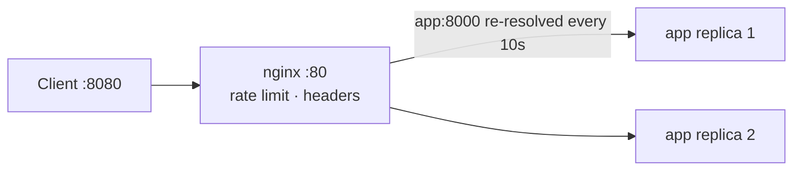

# Nginx reverse proxy

Nginx in front of two backend replicas. One published port, load balancing over
Docker's embedded DNS, health-gated startup, per-IP rate limiting.



## Run

```bash
docker compose up --build -d
```

## See the load balancing

```bash
for i in $(seq 1 6); do curl -s localhost:8080/ | python3 -c \
  'import sys,json; print(json.load(sys.stdin)["replica"])'; done
# alternates between the two replica hostnames
```

```bash
curl -s localhost:8080/ | python3 -m json.tool
curl -s localhost:8080/nginx-health
```

## What to notice

| Detail | Why | Chapter |
|--------|-----|---------|
| Only nginx publishes a port | The backend is unreachable from the host — the proxy is the sole entry point | [06](../../docs/06-networking.md) · [11](../../docs/11-security.md) |
| `resolver 127.0.0.11` + a variable in `proxy_pass` | A static `upstream` block resolves once at startup and pins one replica | [06](../../docs/06-networking.md) |
| `depends_on: condition: service_healthy` | Nginx would fail to start if it resolved `app` before any replica existed | [05](../../docs/05-compose.md) |
| `deploy.replicas: 2` | Compose v2 honours this on plain Docker | [05](../../docs/05-compose.md) |
| App binds `0.0.0.0`, not `127.0.0.1` | Binding loopback inside a container makes it unreachable from the proxy | [06](../../docs/06-networking.md) |
| `access_log /dev/stdout` | Logs go to the Docker log driver, not a file inside the container | [10](../../docs/10-monitoring-logging.md) |
| `X-Request-ID` forwarded | One request can be traced across proxy and app logs | [10](../../docs/10-monitoring-logging.md) |

## Test the rate limit

```bash
for i in $(seq 1 40); do
  curl -s -o /dev/null -w '%{http_code} ' localhost:8080/
done; echo
# 200s until the burst of 20 is used, then 503s
```

## Test resilience

```bash
# Kill one replica — traffic keeps flowing through the other
docker compose ps
docker kill $(docker compose ps -q app | head -1)
for i in $(seq 1 4); do curl -s localhost:8080/ | grep -o '"replica": "[^"]*"'; done

# restart: unless-stopped brings it back
sleep 5 && docker compose ps
```

## Scale

```bash
docker compose up -d --scale app=4
for i in $(seq 1 8); do curl -s localhost:8080/ | grep -o '"replica": "[^"]*"'; done
```

## Clean up

```bash
docker compose down
```
 
 
